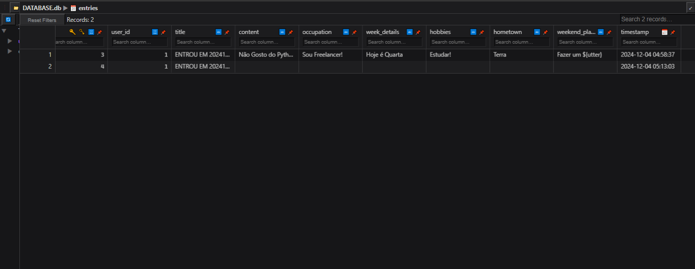

# CRUD COM FASTHTML
👨‍🏫GERENCIADOR DE POSTAGENS COM FUNÇÕES DE CRUD, DESENVOLVIDO EM FASTHTML E SQLITE.

 <br>
 <br>
 <br>
 <br>
 <br>
 <br>

## DESCRIÇÃO:
Este projeto é um **diário online** baseado em um sistema de entradas. Ele permite aos usuários registrar, visualizar, editar e excluir anotações pessoais (CRUD). O sistema utiliza **FastHTML** para criar uma interface web dinâmica e **SQLite** para gerenciar os dados de usuários e entradas.  

## FUNCIONALIDADES:
1. **Gerenciamento de usuários:**  
   - Criação automática de usuários ao entrar no sistema.
   - Associar entradas a usuários específicos.

2. **Gerenciamento de entradas:**  
   - Criar entradas com título, história, ocupação, detalhes da semana, hobbies, cidade natal e planos de fim de semana.  
   - Visualizar todas as entradas de um usuário ou entradas globais.
   - Editar ou excluir entradas específicas.  

3. **Interface dinâmica:**  
   - Navegação simplificada com botões estilizados.  
   - Suporte a atualização assíncrona usando `htmx`.

4. **Banco de dados SQLite:**  
   - Armazena usuários e entradas.  
   - Atualização automática de tabelas durante a configuração inicial.

## EXECUTANDO ESSE PROJETO:
1. **Instalação das Dependências::**
   - Entre no diretório `CODIGO` e execute o comando:

   ```bash
   pip install -r requirements.txt
   ```

2. **Execução do Aplicativo:**
   - Para executar o arquivo Python, utilize o comando abaixo no terminal, dentro do diretório `./CODIGO`:
   ```bash
   python main.py
   ```

3. **Acesse a página inicial:** 
   - Acesse [http://localhost:5001](http://localhost:5001) no navegador para realizar login ou criar um novo usuário digitando o nome de usuário. 

4. **Criar uma nova entrada:**  
   - Após o login, preencha o formulário exibido e clique em "SALVAR" para registrar a entrada.

5. **Visualizar entradas:**  
   - Clique no botão **"ENTRADAS"** para exibir todas as entradas registradas. Em seguida, selecione a entrada desejada para visualizá-la em detalhes.

6. **Editar ou excluir entradas:**  
   - Utilize os botões localizados ao lado de cada entrada para editá-la ou removê-la, conforme necessário.

## NÃO SABE?
- Entendemos que para manipular arquivos em muitas linguagens, é necessário possuir conhecimento nessas áreas. Para auxiliar nesse aprendizado, oferecemos cursos gratuitos disponíveis:
* [CURSO DE PYTHON](https://github.com/VILHALVA/CURSO-DE-PYTHON)
* [CURSO DE FASTHTML](https://github.com/VILHALVA/CURSO-DE-FASTHTML)
* [CURSO DE SQLITE](https://github.com/VILHALVA/CURSO-DE-SQLITE)
* [CURSO DE PYTHON COM SQLITE](https://github.com/VILHALVA/CURSO-DE-PYTHON-COM-SQLITE)
* [CONFIRA MAIS CURSOS](https://github.com/VILHALVA?tab=repositories&q=+topic:CURSO)

## CREDITOS:
- [PROJETO CRIADO PELO VILHALVA](https://github.com/VILHALVA)


